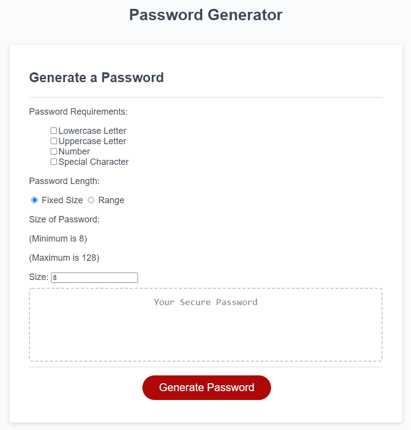
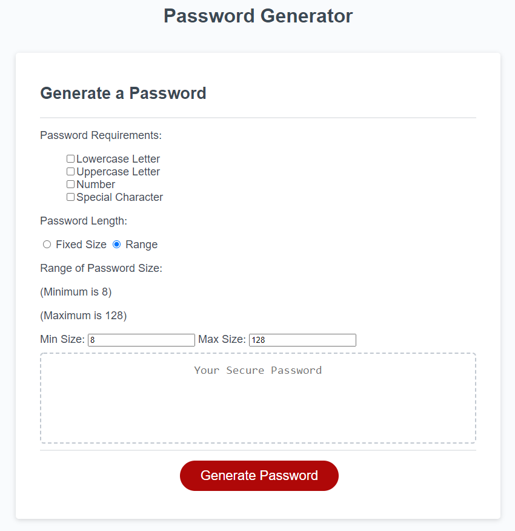

# Random Password Generator
A website that uses javascript to produce a password that meets the users requirements for a website. 

The first set of options include special characters, numbers, lowercase characters, and uppercase characters. These options ensure that the password is only made up of the character types checked. 

There is also a password length function that allows you to pick a fixed password size or a password range that will randomize the size of the password within given parameters.

## Error Handling
There is also some error handling to ensure that certain cases don't occur. 

For example: 
* If no character types are selected, then it will open a menu to alert the user and end the password generation.
* The length parameters will only allow numbers to be typed in. 
* All values have default values plugged in to prevent empty data. 
* If the user gives a number less than 8, then it will default to 8. 
* If the user gives a number greater than 128, it will default to 128. 
* It will reverse min and max, if max is less than min for size range. 

Thought about adding the ability to remove forbidden characters manually, however, it quickly became too user unfriendly and was decided on as better to leave out and reduce the special characters to the most common set of accepted characters.

## User Interface for Fixed Size

## User Interface for Size Range
